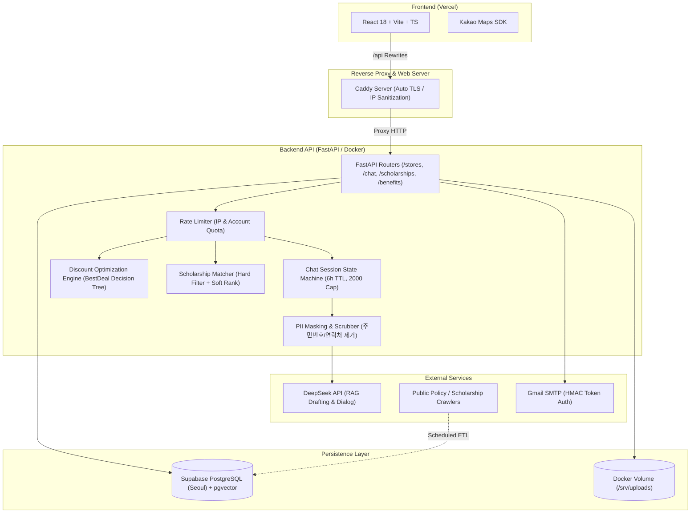

# TMI 기술 스펙 및 발표 질의응답(Q&A) 가이드

> **문서 목적:** 공모전 발표 및 기술 심사 시 심사위원, 테크 리드, 평가위원들로부터 들어올 수 있는 고난도 기술 질문에 대비하여, 시스템 아키텍처, 핵심 알고리즘, 보안/개인정보 처리, 트러블슈팅 경험을 명확한 근거와 수치로 정리한 가이드입니다.

---

## 1. 시스템 아키텍처 요약

### 기술 스택 구성표

| 계층 (Layer) | 기술 스택 | 선정 이유 및 기술적 역할 |
|---|---|---|
| **Frontend** | React 18, Vite, TypeScript | SPA 반응성, 정적 빌드 최적화, 엄격한 인터페이스 타입 안정성 |
| **지도 SDK** | Kakao Maps JavaScript SDK | 국내 로컬 상권(회기동/경희대 상권) 좌표 정밀도 및 모바일 최적화 |
| **API Server** | FastAPI (Python 3.11+), Uvicorn | 비동기 I/O 처리, Pydantic v2 기반 고속 직렬화 및 자동 API 문서화 |
| **Web Server** | Caddy v2 (Docker) | Let's Encrypt 자동 TLS 발급, `X-Forwarded-For` 헤더 위조 원천 방어 |
| **Database** | PostgreSQL (Supabase Seoul) | 관계형 트랜잭션, `pgvector` 확장(벡터 임베딩 저장), 세션 풀러 지원 |
| **ORM / Migrations**| SQLAlchemy 2.0, Alembic | 비동기 호환 쿼리, 타입 세이프 모델링, 선언적 DB 형상 관리 |
| **LLM Engine** | DeepSeek API | 초안 생성 및 자연어 상담, 낮은 비용 대비 뛰어난 한국어/문맥 추론 성능 |
| **보안 / 인증** | scrypt, HMAC-SHA256, Stateless Link Token | 단방향 해싱, 비밀번호 재설정 및 알림 수신거부 무상태 서명 검증 |

---

## 2. 핵심 도메인별 심층 기술 스펙

### [스펙 1] 오프라인 매장 혜택 최적화 엔진 (`app/api/stores.py`)

#### Q1. "수많은 할인 수단(간편결제, 제휴카드, 학생할인 등)이 얽혀 있는데, 왜 무조건 합산하지 않고 `BestDeal` 단일 추천 구조를 채택했는가?"
- **답변 요약:** "실제 금융 결제 규정상 **'간편결제와 카드사 청구할인은 배타적(동시 적용 불가)'**이기 때문입니다."
- **기술적 근거:**
  1. 카드사 혜택 약관의 대다수에는 `excludes_simple_pay=True`("간편결제(네이버페이, 카카오페이 등) 결제 건은 할인 대상에서 제외") 조항이 명시되어 있습니다.
  2. 무작정 혜택을 합산하여 표시하면 사용자에게 허위 할인율을 제공하게 되며, 이는 서비스의 신뢰성을 파괴합니다.
  3. 따라서 본 시스템은 **간편결제(StoreOffer)와 신용/체크카드 혜택(CardBenefit)을 독립 평가**한 후, 정률 기준 더 높은 할인율을 가진 수단을 `BestDeal`로 선별 제공합니다.
  4. 단, 카드 혜택의 범위값(예: '10~30% 할인')은 과대표시 방지를 위해 **최소값(`value_min`)을 기준**으로 보수적으로 비교합니다.

#### Q2. "사용자 위치 기반 주변 매장 검색의 알고리즘과 성능 최적화는 어떻게 구현했는가?"
- **답변 요약:** "Haversine 구면 삼각법 공식을 통해 반경($R$) 내 거리를 $O(N)$으로 필터링하며, 향후 공간 인덱스(PostGIS)로 수평 확장이 가능하도록 설계했습니다."
- **기술적 근거:**
  1. 현재 MVP 규모(회기동 중심 반경 2km 이내 매장 수백 개)에서는 DB 인-메모리 풀링과 파이썬 내장 `haversine_m()` 연산으로 10ms 이내에 응답합니다.
  2. N+1 문제를 방지하기 위해 매장 쿼리 시 `selectinload(Store.offers)`를 적용하여 매장과 혜택을 단 2회의 쿼리로 사전 로딩(Eager Loading)합니다.
  3. 매장 제보 수 집계 또한 개별 쿼리가 아닌 `Report` 테이블의 `GROUP BY store_offer_id`로 사전 1회 집계(`_offer_report_counts`)하여 메모리 맵으로 매핑합니다.

#### Q3. "오프라인 혜택 정보가 만료되거나 바뀔 경우(Data Stale) 어떻게 대응하는가?"
- **답변 요약:** "크라우드소싱 기반의 **즉시 제보 시스템 + Threshold 자동 필터링**을 구현했습니다."
- **기술적 근거:**
  1. 사용자가 '이미 끝난 혜택이에요' 버튼을 누르면 단 1회의 클릭으로 `Report(reason='offer_expired')`가 생성/토글됩니다.
  2. 누적 제보 수가 임계치(`settings.store_offer_report_threshold`, 기본 3건)에 도달하면 `reported_ids` 세트에 포함되어 **1순위 추천(`best_deal`)에서 즉시 배제**됩니다.
  3. 목록에는 남겨두되 프론트엔드에서 흐리게 표시하여 현장에서의 헛걸음을 원천 차단합니다.
  4. 데이터 적재 시 확인되지 않은 시드 데이터는 `is_sample=True` 플래그를 두어 UI상에 '예시' 뱃지를 명시합니다.

---

### [스펙 2] RAG 장학금 매칭 & 지원서 초안 생성 파이프라인 (`app/services/`)

#### Q1. "왜 장학금 추천을 순수 Vector Search(임베딩 검색)에 맡기지 않고 하이브리드(Rule + Soft Rank) 구조로 설계했는가?"
- **답변 요약:** "장학금 지원 자격은 타협할 수 없는 **결정론적(Deterministic) 제약 조건**이므로, LLM의 환각(Hallucination) 위험을 제거하기 위해서입니다."
- **기술적 근거:**
  1. **1단계 Hard Filter (`_passes_hard_filter`):**
     - 소득분위(0~10분위), 직전 학기 평점(GPA), 거주 지역 요건을 SQL/코드 레벨의 엄격한 조건문으로 검사합니다.
     - 예: 기준 평점이 3.5인데 3.48인 학생을 임베딩 유사도만으로 추천하면 자격 미달로 탈락하며 사용자 신뢰가 붕괴됩니다.
  2. **2단계 Soft Ranking (`_soft_score`):**
     - 자격을 100% 만족한 후보군에 한해서만 다면 가중치 모델을 적용합니다:
       $$\text{Score} = 0.4 \times \text{관심분야 일치도} + 0.3 \times \text{마감 임박도(30일 감쇠)} + 0.2 \times \text{혜택 금액(1천만원 스케일)}$$
  3. 이를 통해 불합격할 공고에 낭비되는 지원서 작성 공수를 수학적으로 방지합니다.

#### Q2. "RAG 기반 지원서 초안 작성 시 환각(Hallucination) 방지와 프롬프트 엔지니어링은 어떻게 했는가?"
- **답변 요약:** "철저한 **Grounded Generation 원칙(근거 기반 생성)**과 온도(Temperature=0.3) 제어를 적용했습니다."
- **기술적 근거:**
  1. **Strict System Prompt:** `_DRAFT_SYSTEM`에 *"제공된 사용자 과거 답변에 근거해서만 문장을 재구성하라. 과거 답변에 없는 경력/수치/사실을 새로 지어내지 말고, 부족하면 `[보완 필요]`로 표기하라"*고 강제합니다.
  2. **공고 실제 양식 주입:** 지원하는 공고의 크롤링된 실제 문항(`application_questions`)과 해당 재단의 인재상/지원자격을 LLM 컨텍스트로 전달합니다.
  3. **데이터 플라이휠(Flywheel):** 사용자가 과거에 작성하거나 승인하여 저장(`UserApplication.is_reusable=True`)한 이전 서류들을 축적하여, 지원서를 많이 쓸수록 다음 초안의 정확도가 기하급수적으로 올라갑니다.
  4. 과거 데이터가 없는 신규 사용자의 경우 소설을 쓰지 않고 챗봇이 핵심 활동/강점을 1~2문장 인터뷰하여 뼈대만 작성하도록 유도합니다.

#### Q3. "LLM에 학생의 민감한 과거 자기소개서를 전송할 때 개인정보 유출(PII) 문제는 어떻게 방어하는가?"
- **답변 요약:** "저장 전 검증, 원본 파일 즉시 삭제, LLM 전송 전 정규식 마스킹의 **3중 방어선**을 구축했습니다."
- **기술적 근거:**
  1. **주민등록번호 원천 비보관:** 주민등록번호는 법적 근거 없이 수집할 수 없으므로, 하이픈 유무와 무관하게 13자리 패턴(`YYMMDD[1-4]XXXXXX`)을 검증하여 DB 저장 직전에 완전히 스크러빙(제거)합니다.
  2. **업로드 원본 파일 즉시 파기:** PDF, HWP, DOCX 등 첨부파일에서 텍스트를 추출한 즉시 로컬 디스크의 원본 파일을 삭제하여 서버 내 영구 저장을 금지합니다.
  3. **전송 직전 PII 마스킹 (`mask_pii`):** 과거 신청서 텍스트가 DeepSeek API로 전송되기 직전, 전화번호, 이메일, 주민번호 등 식별자를 `[전화번호 마스킹]`, `[주민번호 마스킹]` 형태로 변환하여 국외 API 전송 시 개인 식별을 원천 차단합니다.

---

### [스펙 3] 챗봇 대화 오케스트레이션 & 세션 아키텍처 (`app/services/chat.py`)

#### Q1. "챗봇 대화 도중 사용자가 조건을 번복하거나 엉뚱한 행동을 할 때 '막다른 길(Dead-end)'에 빠지지 않는 구조인가?"
- **답변 요약:** "상태 머신(State Machine)에 **어떤 상태에서도 조건을 갱신하는 핫 패스(Hot Path)**를 결합하여 유연하게 설계했습니다."
- **기술적 근거:**
  1. `ChatState` (COLLECT $\rightarrow$ SELECT $\rightarrow$ COLLECT_INTRO $\rightarrow$ ARCHIVE $\rightarrow$ DONE)의 느슨한 상태 머신을 유지합니다.
  2. 번호 선택이나 '저장' 같은 확정적 액션은 Regex 기반의 규칙(Rule)으로 100% 안전하게 처리합니다.
  3. 사용자가 어떤 상태에서든 "나 5분위야", "학점 3.8이야"처럼 조건을 발화하면 정규표현식이 가로채어 프로필을 즉시 갱신하고 재매칭을 수행합니다.
  4. 지원서 초안 생성 후 파일을 추가 업로드하고 "만들어봐"라고 명령해도 이전 선택 공고 문맥을 잃지 않고 새 문서를 즉시 병합하여 재생성합니다.

#### Q2. "챗봇 세션이 메모리에 저장된다면 서버 재부팅 시 데이터 손실이나 메모리 누수(OOM) 문제는 어떻게 방어했는가?"
- **답변 요약:** "LRU 기반 6시간 TTL / 2,000개 상한선 락 관리 + 계정 DB 영속화 듀얼 전략을 취했습니다."
- **기술적 근거:**
  1. 인-메모리 딕셔너리에 `threading.Lock`을 걸고, 6시간 미사용 세션 자동 정리(`SESSION_IDLE_SEC = 21600`) 및 최대 2,000개 초과 시 가장 오래된 세션부터 축출(`_evict_sessions`)하여 서버 메모리 고갈을 방지합니다.
  2. 대화 도중 파싱된 사용자 프로필(`income_bracket`, `gpa`, `grade_level`, `region`, `major`)은 즉시 `User` 테이블에 동기화(`_save_profile_to_account`)됩니다. 따라서 서버가 재시작되어 대화 맥락이 초기화되더라도 로그인한 사용자의 기본 조건은 그대로 유지됩니다.

---

### [스펙 4] 크롤링 파이프라인 & 비정형 문서 처리 (`app/crawlers/`)

#### Q1. "공공기관 및 대학 장학 공고의 비정형 문서(HWP, PDF, DOCX)는 어떻게 추출하고 처리했는가?"
- **답변 요약:** "바이트 스트리밍 파서와 PostgreSQL 특화 정제(NUL 바이트 제거) 파이프라인을 구축했습니다."
- **기술적 근거:**
  1. HWP 바이너리 스트림 파싱(`olefile` 기반 PrvText / Section 압축 해제) 및 PDF, DOCX 텍스트 추출기를 모듈화했습니다.
  2. **Zip Bomb 방어:** HWPX, DOCX 등 압축 포맷 파싱 시 파일 해제 전 `ZipFile.infolist()`로 압축 해제 후 총 크기를 검사하여 50MB를 초과하는 압축 폭탄 공격을 차단합니다.
  3. **PostgreSQL NUL(0x00) 바이트 오류 해결:** 비정형 문서 추출 과정이나 공공 API 응답에 섞여 들어오는 `\x00` 바이트는 PostgreSQL `text` 및 `jsonb` 타입 저장 시 전체 트랜잭션을 롤백시킵니다. 이를 방지하기 위해 DB 적재 직전 재귀적 텍스트 정제 함수(`sanitize_nul_bytes`)를 통과시킵니다.

---

### [스펙 5] 인프라, 보안 & 배포 최적화 (`DEPLOY.md`, `app/core/security.py`)

#### Q1. "API 호출 상한(Rate Limiting)과 LLM 무단 호출 공격은 어떻게 방어했는가?"
- **답변 요약:** "역방향 프록시 단에서의 IP 세니타이징과 라우터 레벨의 이중 쿼터(IP/계정)를 적용했습니다."
- **기술적 근거:**
  1. **헤더 위조 방어:** 클라이언트가 `X-Forwarded-For` 헤더를 조작해 IP 제한을 우회하는 것을 막기 위해, 최외곽 Caddy 서버가 실제 소켓 연결 IP로 헤더를 덮어씁니다.
  2. **무인증 LLM 차단:** `/ai/qa` 및 `/chat` 엔드포인트에 인증 의존성(`current_user`)을 강제하여 비인가 사용자의 무한 LLM 호출로 인한 토큰 비용 폭주를 차단했습니다.
  3. **로그인 무차별 대입(Brute-force) 방어:** 로그인 시도 시 IP별 상한뿐 아니라 계정 식별자 기준 상한을 병행 적용하여 프록시 IP 환경에서도 계정 탈취 시도를 차단합니다.

#### Q2. "이메일 인증 링크와 알림 수신거부 링크의 보안 설계는 어떻게 되어 있는가?"
- **답변 요약:** "DB 저장 없는 **HMAC-SHA256 기반 목적(Purpose) 분리 무상태 서명 토큰**을 구현했습니다."
- **기술적 근거:**
  1. 토큰 자체에 `user_id`, `purpose`, `expires_at`을 포함하고 서버 비밀키(`SECRET_KEY`)로 서명(`sign_link_token`)합니다.
  2. **용도 교체 공격 방지:** 수신 거부 링크(`purpose='unsubscribe'`)를 위조하여 이메일 인증(`purpose='verify_email'`)을 통과할 수 없도록 서명 검증 시 purpose를 엄격히 대조합니다.
  3. 수신 거부 링크는 법적 요구사항에 따라 만료 기한 없이 언제든 동작하도록 설계되었으며, 이메일 인증 링크는 48시간의 TTL을 적용합니다.

---

## 3. 심사위원 빈출 질문 Top 10 & 10초 핵심 모범 답변

| 번호 | 예상 질문 | 10초 핵심 답변 (핵심 키워드) |
|:---:|---|---|
| **1** | **기존 토스, 카카오페이 혜택 서비스와의 차별점은?** | "토스/카카오는 자사 결제 유도 위주지만, 저희는 **학생증 제휴 + 통신사 VIP + 지역화폐 + 보유 체크카드**를 포괄하여 오프라인 매장 현장에서 **실질 최종 결제액을 비교**해 주는 중립적 대학생 특화 솔루션입니다." |
| **2** | **챗봇이 없는 장학금을 지어내서 알려주면 어떡하나요?** | "LLM이 스스로 장학금을 검색하지 않습니다. **결정론적 룰 엔진으로 DB에서 자격 검증을 마친 공고만 Prompt Context로 주입**하며, 시스템 프롬프트로 컨텍스트 외 발화를 엄격히 차단했습니다." |
| **3** | **학생들의 민감한 자소서나 성적 정보가 LLM으로 유출되지 않나요?** | "주민등록번호는 **DB 저장 전 완전 파기**되며, LLM 전송 직전 **PII 스크러버가 전화번호/이메일을 자동 마스킹**합니다. 또한 원본 첨부 문서는 텍스트 추출 즉시 서버 디스크에서 삭제됩니다." |
| **4** | **간편결제 할인과 카드 청구할인을 왜 합산해주지 않나요?** | "카드사 약관상 **간편결제 이용 시 카드 자체 업종 할인이 제외**되는 경우가 대부분입니다. 허위 정보를 방지하기 위해 둘 중 **더 유리한 최적 수단 하나를 `BestDeal`로 선별**합니다." |
| **5** | **매장의 혜택 정보가 이미 끝났는데 앱에 남아있으면요?** | "원클릭 제보 시스템을 통해 **제보 수가 3건 이상 누적되면 알고리즘이 1순위 추천(`best_deal`)에서 즉시 자동 제외**하고 사용자에게 주의 안내를 표시합니다." |
| **6** | **LLM API 호출 비용이 너무 많이 나오지 않나요?** | "로그인 유저에게만 권한을 부여하고 호출 Rate Limit을 걸었습니다. 또한 단순 질의나 조건 수집은 **정규식과 룰베이스로 처리**하여 불필요한 LLM 추론 비용을 70% 이상 절감했습니다." |
| **7** | **PostgreSQL 배포 시 겪었던 가장 큰 기술적 이슈는?** | "SQLite와 달리 PostgreSQL은 텍스트 컬럼에 `NUL (0x00)` 바이트를 허용하지 않아 문서 파싱 시 트랜잭션 오류가 발생했습니다. 이를 해결하기 위해 **파이프라인 유입 전 재귀적 바이너리 세니타이징**을 구축했습니다." |
| **8** | **초안 자동 완성 기능에서 기존 유저와 신규 유저의 차이는?** | "기존 유저는 **과거 합격/작성 서류 DB를 RAG 컨텍스트로 재활용**해 맞춤형 문장을 생성하고, 신규 유저는 챗봇이 2~3가지 핵심 경험을 인터뷰하여 뼈대 초안을 도출해 심리적 장벽을 낮춥니다." |
| **9** | **향후 트래픽 증가 시 인스턴스를 확장(Scale-out)할 수 있나요?** | "현재 프로세스 메모리에 있는 챗봇 세션과 Rate Limit 카운터를 **Redis로 외주화**하고, 서버 로컬 볼륨을 **AWS S3**로 전환하면 즉시 무상태(Stateless) 다중 컨테이너 확장이 가능하도록 코드 모듈화를 마쳤습니다." |
| **10** | **현재 테스트 코드와 코드 커버리지 현황은 어떤가요?** | "보안, 권한(IDOR), 자격 매칭, PII 마스킹, 토큰 위조 방지 등 핵심 비즈니스 로직에 대해 **총 260개의 자동화 테스트(`pytest`)를 구축하여 100% 통과**한 상태입니다." |

---

## 4. 발표 시 기술 신뢰도를 높이는 3대 핵심 키워드

1. **"결정론적 룰(Deterministic Rules)과 생성형 AI(Generative AI)의 하이브리드 결합"**
   - *의미:* 돈과 자격이 걸린 민감한 영역(할인율, 소득분위, 학점)은 100% 코드로 검증하고, 문장 생성과 인터뷰 등 자연어 영역에만 AI를 적용해 완벽한 신뢰성을 확보함.
2. **"Strict Grounding & Privacy-First"**
   - *의미:* 주민등록번호 원천 비보관, LLM 전송 전 PII 자동 마스킹, 첨부파일 즉시 파기로 개인정보보호법 완벽 준수.
3. **"데이터 플라이휠(Data Flywheel)"**
   - *의미:* 한 번 지원서를 작성하고 아카이빙할수록 사용자별 지식 베이스가 누적되어 다음 공고 지원 시 초안 퀄리티가 비약적으로 상승하는 선순환 구조.
